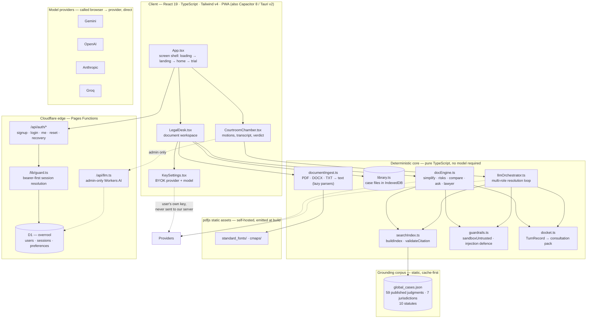
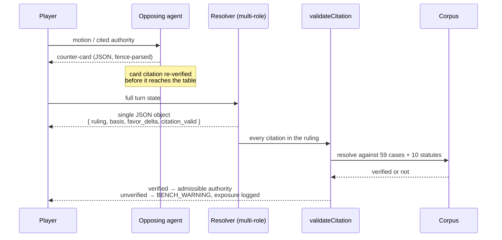
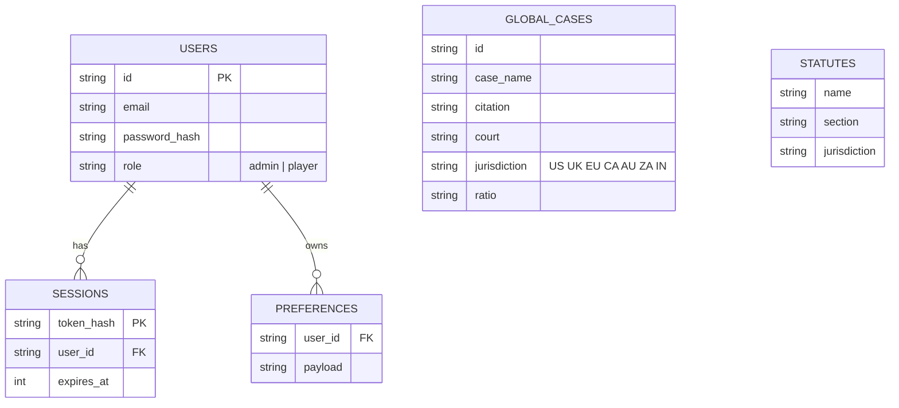

# Architecture

How Overrool is built, and — more importantly — **where the model is allowed to influence an answer and where it is not.**

Three properties drive every decision below:

1. **Grounding over fluency.** A legal tool that invents authority is worse than no tool. Every citation the model offers is resolved against an embedded corpus before it reaches the screen, and unverified authority is treated as an attack surface, not a citation.
2. **The user's key, the user's quota.** Model calls go from the browser straight to the provider the user chose. There is no server-side proxy holding user keys.
3. **Assistance, never advice.** The product explains and organises. It does not replace a licensed advocate, and it says so in the interface, not only in the docs.

---

## 1. System layers



---

## 2. The agentic layer — and its leash

There are two model-driven subsystems. Both are **multi-role, single-turn, schema-constrained**, and both are overridden by local verification.

### 2.1 Trial resolution — one pass, three voices

`llmOrchestrator.ts` resolves a whole turn in **one** structured request rather than a chat chain: the **Presiding Judge** rules, the **Opposing Senior Advocate** answers, and **Co-Counsel** pressure-tests — all inside a single JSON object with an exact schema. The parser (`parseResolution`) rejects any reply that is not a single well-formed JSON object with every required field, and `parseOpponentReply` does the same for the opponent agent, verifying any card it plays back through the corpus before it is admitted to the table.



**The leash:** `citation_valid` is not something the model is trusted to self-report. The prompt asks it to reflect local verification, and then `searchIndex.validateCitation` re-derives the answer from the corpus. When the two disagree, the corpus wins. Fabricated authority lowers the player's own position — the game treats a bad citation as a mistake to be punished, not a feature to be rewarded.

### 2.2 Legal Desk — five operations, grounded in the user's own text

`docEngine.ts` maps one operation onto each class of document work:

| Op | Input | Output |
|---|---|---|
| `simplify` | one document | bottom line, plain-language bullets, who it affects, glossary |
| `risks` | one document | sentence-level findings, each with a kind (obligation / risk / inconsistency / opportunity / unclear) and severity 1–5 |
| `compare` | two documents | material-difference table per topic, who each version favours, which version wins |
| `ask` | document + question | grounded answer, the quoted sentence it rests on, confidence, next steps |
| `lawyer` | one document | the questions most likely to change a decision, why each matters, which papers to bring |

Every answer is constrained to the supplied text. The desk refuses to reason "from a vague memory of the law at large" — a question the document does not answer returns the honest answer that it does not, along with what to raise with a lawyer.

### 2.3 The keyless path is a real product, not a stub

With no API key, `docEngine` runs a **deterministic Local Rules Analyst** and the bench runs a **deterministic Local Judge**: clause extraction, sentence scoring, and citation matching with no model in the loop. It is labelled as local everywhere it appears. A user with no key and no card can still complete every interaction, and the interface never implies a local heuristic is a model.

### 2.4 Getting a document in, and keeping it

A legal tool that requires the user to retype a 40-page contract is not a tool, so the desk accepts **PDF, `.docx`, and plain text** by drag-and-drop or file picker.

| Stage | Behaviour |
|---|---|
| Detection | Extension and MIME type; a legacy `.doc` is rejected with instructions rather than failing obscurely |
| PDF | `pdfjs-dist`, lazy-loaded on first upload, reading pages in order |
| DOCX | `mammoth`, lazy-loaded; both `arrayBuffer` and `buffer` inputs are supplied so it works under either build resolution |
| Text | Read directly; CRLF, soft hyphens, zero-width joiners and BOM are normalised without touching real spaces |
| Limits | 20 MB and 2 M characters, refused explicitly instead of silently truncating |
| Honesty | A scanned, image-only PDF yields *no* text and is reported as needing OCR — never silently analysed as empty |
| Assets | Standard-14 font metrics and CJK maps are copied out of `node_modules` at build time and self-hosted, so no third-party CDN ever receives a document |

Saved documents are grouped into **case files** and persisted in **IndexedDB** (`library.ts`). IndexedDB rather than `localStorage` because a single contract exceeds the ~5 MB web-storage ceiling. The persisted payload is validated on read and tolerant of corruption: malformed entries are dropped, and a case file can never reference a document that failed validation. Everything stays on the device — see [PRIVACY.md](PRIVACY.md).

---

## 3. Trust boundaries

| Boundary | Mechanism | File |
|---|---|---|
| User document → model | Untrusted input is wrapped in explicit `<untrusted-data>` fences; a directive-injection defence sits in front of it | `core/guardrails.ts` |
| File → text | Parse happens in-browser; size, type and empty-text are validated before any text reaches the model | `core/documentIngest.ts` |
| Model → outbound request | Provider origin allowlist; any non-provider origin raises a `security` error before a byte leaves | `core/providerCall.ts` |
| Model → displayed citation | Corpus re-verification; local result overrides the model's self-report | `core/searchIndex.ts` |
| Browser → our API | Bearer-first session resolution, hashed session tokens, `__Host-` cookies, 30-day TTL | `functions/lib/guard.ts`, `functions/lib/auth.ts` |
| User → server-side inference | `user.role !== 'admin'` returns 403 — hosted inference is reserved for the workspace administrator | `functions/api/llm.ts` |
| Model output → application state | Strict single-object JSON schema with required-field validation; malformed output is an error, never a partial parse | `core/llmOrchestrator.ts` |

**Key handling.** A user's provider key is persisted on their device and is used for direct browser → provider calls. It is never transmitted to Overrool's servers, never written to D1, and never proxied. The only server-side inference path is the administrator's own.

---

## 4. Data



`GLOBAL_CASES` and `STATUTES` are a static snapshot served as a cache-first asset — the grounding set is versioned with the app, so verification results are reproducible and a citation that verifies today verifies on every device that loads the same build.

**Corpus composition (59 published judgments).** United States 11 · India 12 · United Kingdom 8 · European Union 7 · Canada 7 · Australia 7 · South Africa 7, plus 10 statutory references.

---

## 5. Request paths, end to end

**Keyless desk analysis** — no network, no account, no key:

```
LegalDesk → docEngine (local) → searchIndex.validateCitation → Corpus → render
```

**BYOK desk analysis:**

```
LegalDesk → providerCall.requestChat (origin allowlist) → provider
         ← strict JSON → docEngine parse → verify any citation → render
```

**Trial turn:**

```
CourtroomChamber → llmOrchestrator (opponent agent + multi-role resolver, one pass)
                 → searchIndex.validateCitation → FavorMeter + transcript + docket
```

**Hosted inference (administrator only):**

```
CourtroomChamber → /api/llm → guard (bearer, role=admin) → Workers AI → verdict
```

---

## 6. Deployment shape

| Concern | Choice | Why |
|---|---|---|
| Static hosting | Cloudflare Pages | Global edge, zero compute cost at this scale |
| Data | D1 (SQLite) | Free tier; sufficient for accounts, sessions, preferences |
| Functions | Pages Functions (`/api/*`) | Same origin as the app — no CORS surface, no separate service |
| Model access | Browser → provider, direct | User keys never transit our infrastructure |
| Hosted fallback | Workers AI, admin-gated | One shared inference path, explicitly not a user path |
| Client targets | PWA + Capacitor 8 (iOS/Android) + Tauri v2 (desktop) | One codebase, installable everywhere |

**Quality gate.** Every change is verified by `scripts/knucklegate.mjs`: app and workers typecheck, lint, the full test suite, a coverage floor, and live checks that the deployed site still answers 200 on the SEO and AI-discovery surfaces. It runs in CI on every push, and the deploy script re-runs it before shipping.

---

## 7. Legal boundary

Overrool provides **information and assistance**. It is a legal-literacy and strategic-simulation tool. It does not provide legal advice, does not create an attorney–client relationship, and cannot replace a qualified legal professional. Every citation a user relies on should be checked against a certified law report. See [DISCLAIMER.md](DISCLAIMER.md).
