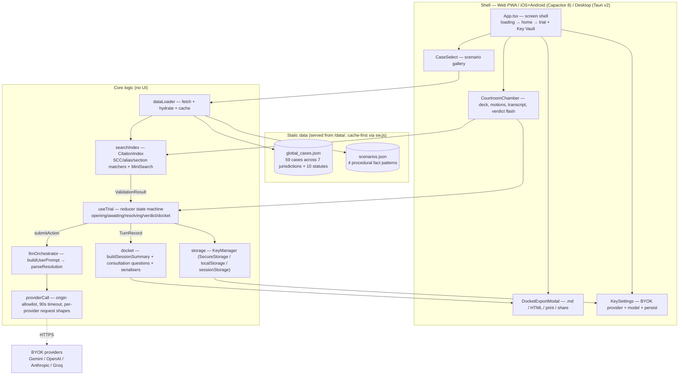
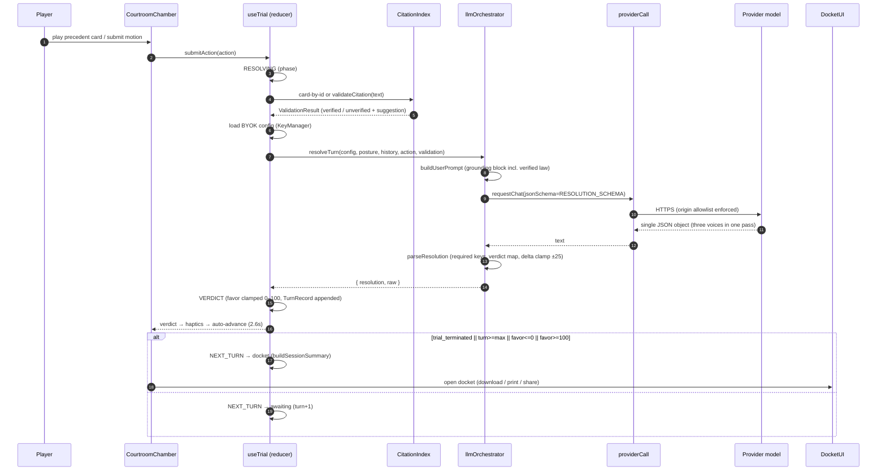

# Overrool

> Understand the contract before you sign it. Know the law before you argue it.

**Overrool is a GenAI assistant for legal assistance and access.** It helps people who cannot afford a lawyer understand the legal documents in front of them — a tenancy agreement, an employment contract, a policy, a court judgment, a notice — and know what to do next. It is free to use, it runs on the reader's own AI provider key, and it is built so that a fabricated citation is a *visible failure*, not a hidden one.

Two surfaces, one pipeline:

- **Legal Desk** — the assistance layer. **Upload a PDF, .docx or .txt** (or paste), and **simplify** it, **compare** two versions, **audit** it for obligations, risks and inconsistencies, **ask questions** answered strictly from the text, and generate a **pre-consultation pack** for a real lawyer. Documents you keep are organised into **case files** in a local library, so a contract and its amendments stay together.
- **Courtroom** — the practice layer. An adversarial strategy game where a **multi-role LLM bench** (Presiding Judge, Opposing Senior Advocate, Co-Counsel) rules on your citations in real time, so you learn to frame arguments, read precedent and spot fabricated authority without risking a real case.

Both sit on the same foundations: an embedded corpus of **59 real, published judgments** spanning seven legal systems (United States, United Kingdom, European Union, Canada, Australia, South Africa, India) plus 10 statutes; **client-side citation verification** against that corpus; a **zero-cost BYOK (bring-your-own-key) architecture** where model calls go from the browser straight to the reader's own provider (React 19, TypeScript, Tailwind v4); and an exportable **Advocate Consultation Docket** (markdown / print / share).

[See the full use-case mapping below](#alignment-with-the-brief-and-genai-architecture) for exactly which brief requirement each feature satisfies and where GenAI runs.

---

## Problem statement

Legal assistance is gated behind money and expertise. Most people cannot afford a lawyer to read a contract, and cannot read one themselves either — so they sign things they do not understand, miss deadlines, and accept obligations they never agreed to. When they do try to learn, they hit the same wall from the other side: legal AI assistants are either expensive subscriptions, or opaque black boxes that confidently fabricate authority and are impossible to check.

Overrool addresses four concrete gaps in legal access:

1. **Free access, not freemium access.** There is no per-seat cost and no feature paywall. The platform runs on Cloudflare's free tiers (Pages, D1, Workers AI), signups are unlimited, and the only server-side AI path is reserved for the administrator's own trials. Everyone else brings their own key — for most readers that is Google's free Gemini tier, at zero cost, with no card.
2. **Assistance on the reader's own document, not general chat.** Legal Desk is not a chatbot that guesses at law. It is constrained to the text the reader supplied. `ask` is prompted to return *"a direct answer grounded in the document; if the document does not say, say so"* — with a supporting quotation, a confidence level, and concrete next steps. An honest *"the document does not answer that"* is a correct result, not a failure.
3. **Factual grounding over confident fluency.** A legal tool that invents authority is worse than no tool, so citations are checked against the embedded 59-case / 10-statute corpus *client-side*. The engine does not take the model's word for its own citations: `searchIndex.validateCitation` re-derives the answer from the corpus, and when the two disagree the corpus wins. Unverifiable authority is surfaced as exposure, not passed off as law.
4. **Accountable, exportable outcomes.** Every turn is resolved in a single structured LLM pass and captured as a typed `TurnRecord`, then rendered into an Advocate Consultation Docket — admitted precedents, identified exposure points, and the questions most likely to change a decision — that is downloadable, printable and shareable. The reader leaves with something they can act on or hand to a professional, not just a chat log.

**Constraint.** Overrool provides legal **information, education and assistance**. It is not a law firm, it does not provide legal advice, it creates no attorney–client relationship, and it does not replace a qualified, locally-licensed legal professional. The corpus spans seven jurisdictions and is a static reference snapshot, not current legislation — every citation must be verified against an official, certified law report before it is relied on. See [DISCLAIMER.md](DISCLAIMER.md).

---

## Alignment with the brief — and GenAI architecture

This project is built against the **"AI for Legal Assistance & Access"** problem statement. The table below maps every use case in the brief to the exact feature that delivers it and to where GenAI actually runs (`→ AI` marks a live model call).

| Brief use case | Where Overrool delivers it | GenAI involvement |
|---|---|---|
| **Simplifying complex legal documents** | Legal Desk → **Simplify**: bottom-line verdict, plain-language bullets, who-it-affects, plain glossary; also every trial ruling is written by the bench as lay-readable law. | `→ AI` `docEngine.genDeskAnalysis(op='simplify')` via BYOK model; keyless = clearly-labeled Local Rules Analyst |
| **Comparing contracts, agreements, or policies** | Legal Desk → **Compare** (Version A vs Version B): material-difference table per topic (liability, termination, data), who each side favours, which version wins. | `→ AI` `genDeskAnalysis(op='compare')` |
| **Highlighting important clauses, obligations, risks, or inconsistencies** | Legal Desk → **Risks & obligations**: sentence-level findings with kind (obligation / risk / inconsistency / opportunity / unclear) and severity 1–5. In-trials, bench rulings and the docket flag exposure points. | `→ AI` `genDeskAnalysis(op='risks')`; trial `llmOrchestrator.resolveTurn` + fact-checked citation gate |
| **Answering questions based on provided legal documents** | Legal Desk → **Ask the text** (grounded answer + quote evidence + confidence + next steps). In-trials, hiring a provision / statute *is* asking the law a question — answered by the Presiding Judge with verified authority only. | `→ AI` `genDeskAnalysis(op='ask')`; `resolveTurn` multi-role pass |
| **Helping users understand their options and potential next steps** | Every trial turn produces a reasoned ruling (sustained/overruled with legal basis); the Advocate Consultation Docket ends with actionable consultation questions and exposure points. | `→ AI` `docket.buildSessionSummary` enrichment (consultation questions) |
| **Generating summaries, checklists, or other actionable outputs** | Legal Desk (Simplify / For-your-lawyer checklists), the final docket, and `legal-desk-*.md` exports (download / copy / share / print). | `→ AI` `genDeskAnalysis(op='lawyer')`, `buildSessionSummary` |
| **Preparing information or questions for a legal professional** | Legal Desk → **For your lawyer**: the questions most likely to change a decision, why each matters, and what papers to bring — a ready-made pre-consultation pack. | `→ AI` `genDeskAnalysis(op='lawyer')` |
| **Access without professional assistance / free access** | Unlimited free accounts, zero per-seat cost, Google Gemini **free tier** as the flagship BYOK path, admin-only Cloudflare Workers AI, and a keyless offline mode that still demonstrates every interaction. | Model calls run direct browser→provider, under the user's own free quota |

### Explicit GenAI architecture

| Service | Where it is used in the product |
|---|---|
| **Google Gemini API** (free tier; Google AI Studio key) — *default* | Every structured model call: trial resolution `llmOrchestrator.ts:resolveTurn` (single-pass multi-role Presiding Judge + Opposing Senior Advocate + Co-Counsel), Legal Desk document operations `docEngine.ts:genDeskAnalysis` (all five ops), docket consultation-question enrichment `docket.ts:enrichConsultationQuestions`. |
| **OpenAI / Anthropic Chat Completions / Groq** — *optional BYOK alternates* | Same five integration points, interchangeable via the Key Vault (`storage.ts` `PROVIDERS`); identical prompt/JSON contract enforced in `requestChat`. |
| **Cloudflare Workers AI** (hosted; `functions/api/llm` + `AI` binding) | Admin-only hosted inference path proxying the same turn-resolution request server-side (free tier, quota guarded). |
| **Local Rules Analyst / Local Judge** (keyless, deterministic) | No model. Clearly-labeled rule-based fallbacks (`docEngine.localDeskAnalysis`, `useTrial` keyless verdicts) so the product is demonstrable with zero credentials — never represented as a model. |

All calls share one disciplined path: `requestChat(providerCall.ts)` → origin allowlist → structured-JSON contract (`response_format: json_object` / schema directive) → typed parse → application state. The engine's **anti-hallucination layer** (`searchIndex.validateCitation` + embedded 59-case corpus) is what lets regulation loading and cite-and-reply work *correctly*, and what makes the bench refuse fabricated authority outright.

### The agentic layer — and the leash on it

The model is never the final authority on a legal claim. Two agentic subsystems run, both **multi-role and single-pass**, both overridden by local verification:

- **Trial resolution (`llmOrchestrator.ts`).** One structured request resolves an entire turn with three distinct voices — a **Presiding Judge** (ruling + legal basis + favor delta), an **Opposing Senior Advocate** (live counter-brief), and **Co-Counsel** (adversarial pressure-test) — emitted as a single validated JSON object. The opponent runs as a genuine **counter-agent**: its reply is fence-parsed, and any card it plays is re-verified against the corpus before it is admitted to the table.
- **Legal Desk (`docEngine.ts`).** Five operations (`simplify` · `risks` · `compare` · `ask` · `lawyer`), each constrained to the user's own text. The desk is told it may not answer "from a vague memory of the law at large," and when the document genuinely does not answer the question, it says so and tells the user what to raise with a lawyer.

**The leash is the important part.** `citation_valid` is not taken on the model's word — the prompt asks it to reflect local verification, and then `searchIndex.validateCitation` re-derives the answer from the 59-case corpus. When they disagree, the corpus wins. A fabricated citation is not a cosmetic error: it is scored as **exposure**, logged into the docket, and used by the opposing agent against the player. Untrusted user text is fenced in `<untrusted-data>` markers behind an injection defence, and any outbound call to a non-provider origin is refused with a `security` error before a byte leaves the browser.

**Keyless is a real product, not a stub.** With no API key at all, a deterministic **Local Rules Analyst** and **Local Judge** run clause extraction, severity scoring, and citation matching with no model in the loop — labelled as local everywhere they appear, never dressed up as a model. A user with no key and no payment card can still complete every interaction end to end.

Full system, trust-boundary and data diagrams: **[ARCHITECTURE.md](ARCHITECTURE.md)**.

---

## Architecture

```
overrool/
├── public/
│   ├── data/
│   │   ├── global_cases.json             ← embedded corpus: 59 landmark cases (US/UK/EU/CA/AU/ZA/IN) + 10 statutes
│   │   └── scenarios.json             ← 4 hand-crafted procedural fact patterns
│   ├── manifest.webmanifest           ← PWA manifest (Legal Noir palette)
│   └── sw.js                          ← cache-first service worker (hashed /assets/ + /data/)
├── src/
│   ├── components/                    ← React UI
│   │   ├── CaseSelect.tsx             ← scenario gallery grid (incl. Legal Desk entry)
│   │   ├── CourtroomChamber.tsx       ← main battle screen (hand on the table, live showdown, transcript, verdict flash)
│   │   ├── LegalDesk.tsx              ← document-understanding workspace (simplify/risks/compare/ask/lawyer) + markdown export
│   │   ├── DocketExportModal.tsx      ← docket modal: download/print/share
│   │   ├── FavorMeter.tsx             ← horizontal Judicial Favor bar
│   │   ├── KeySettings.tsx            ← BYOK key modal (provider, model, persist, live test)
│   │   ├── PrecedentCard.tsx          ← citation card (domain emoji, ratio, statutory chips, exhaustion)
│   │   └── StatutoryNotice.tsx        ← mandatory statutory rider
│   ├── core/                          ← shared logic (no UI)
│   │   ├── dataLoader.ts              ← /data/ fetch + scenario hydration (dedup, cache)
│   │   ├── docket.ts                  ← session summary builder + consultation questions + markdown/sharing
│   │   ├── docEngine.ts               ← Legal Desk GenAI ops + JSON parser + keyless Local Rules Analyst
│   │   ├── deskSamples.ts             ← bundled sample documents for the Legal Desk
│   │   ├── haptics.ts                 ← Capacitor Haptics thin wrapper (no-op on web)
│   │   ├── llmOrchestrator.ts         ← resolveTurn: prompt build → JSON-resolution parse + verdict mapping
│   │   ├── providerCall.ts            ← BYOK network layer: origin allowlist, timeout, per-provider shapes, Gemini key header
│   │   ├── searchIndex.ts             ← MiniSearch citation index + validateCitation (precedent/statute)
│   │   ├── storage.ts                 ← KeyManager (BYOK): Capacitor SecureStorage (native) or localStorage/sessionStorage (web)
│   │   └── useTrial.ts                ← reducer-based trial state machine (favor, phase, turn, log)
│   │   ├── guardrails.ts             ← prompt-injection defence: SECURITY CONTRACT + <untrusted-data> sandbox
│   │   ├── meter.ts                  ← identity-scoped daily credit meter (trial 10, desk op 2)
│   │   └── *.test.ts                  ← Vitest suites adjacent to their module (25 files, 235 tests)
│   ├── game/                          ← playing-card machinery
│   │   ├── cardMeta.ts                ← seeded hand deal, authority weight, suits, turn winner (+ cardMeta.test.ts)
│   │   ├── GameCard.tsx               ← shared playing-card face (corner pips, backs, burnout)
│   │   ├── HandFan.tsx                ← fanned hand with deal-in stagger, tap-to-play
│   │   └── CardTable.tsx              ← centre-table showdown (deal/flip/burn/glow driven by trial phase)
│   ├── types/
│   │   └── legal.ts                   ← all shared TS interfaces + constants (STATUTORY_NOTICE, VERDICT_TAGS, MODEL_DEFAULTS usage)
│   ├── App.tsx                        ← screen shell (loading / home / trial) + key-vault modal + error fallbacks
│   ├── index.css                      ← Tailwind Legal Noir theme tokens
│   └── main.tsx                       ← React root
├── src-tauri/                         ← Tauri v2 desktop shell (Rust) — identifier com.overrool.courts
│   ├── Cargo.toml
│   ├── tauri.conf.json                ← authoritative Tauri config (CSP locked to the 4 provider origins)
│   ├── capabilities/default.json
│   └── src/                           ← main.rs, lib.rs, build.rs
├── capacitor.config.ts                ← Capacitor 8 mobile shell (com.overrool.courts, androidScheme https)
├── vitest.config.ts                   ← jsdom + v8 coverage thresholds
├── vite.config.ts                     ← React + Tailwind plugins
└── tsconfig.json                      ← strict, bundler, ES2022
```

> The authoritative Tauri configuration lives in `src-tauri/tauri.conf.json`. There is intentionally no root-level `tauri.conf.json`.

### Architecture diagram



### Turn-resolution sequence



---

## Quick start

```bash
git clone https://github.com/z99wE/overruled.git overrool && cd overrool

# ensure PATH includes local node/npm (adjust as needed):
export PATH="$HOME/.local/bin:$PATH"

npm install
npm install-scripts approve esbuild fsevents   # npm 12 blocks install scripts

npm run dev        # http://localhost:5173
```

Open the app, arm the Key Vault with a provider key, pick a matter, and play. All inference runs from your browser against your own provider account.

---

## Available scripts

| Script | What it does |
|--------|-------------|
| `npm run dev` | Vite dev server with HMR |
| `npm run build` | `tsc --noEmit` + Vite production build → `dist/` |
| `npm run preview` | Serve production build locally |
| `npm run typecheck` | `tsc --noEmit` (app) + `tsc -p tsconfig.workers.json` (Pages Functions) |
| `npm run lint` | ESLint over `src`, `functions`, `scripts` |
| `npm run test` | Vitest run (all `src/**` + `functions/**` suites, 235 tests) |
| `npm run test:coverage` | Vitest with v8 coverage report + thresholds |
| `npm run icons` | Regenerate `public/icons/*.png` from `public/icon.svg` (needs `sharp`) |
| `npm run cf:dev` | `wrangler pages dev` — static shell + Functions + local D1 |
| `npm run cf:deploy` | Build + `wrangler pages deploy` to Cloudflare Pages |
| `npm run deploy` | **One-command production deploy** — typecheck → lint → test → apply D1 schema → build → deploy |
| `npm run d1:create` | Create the D1 database (once, then paste its id into `wrangler.toml`) |
| `npm run d1:migrate` | Apply `d1/schema.sql` to remote D1 |
| `npm run cap:sync` | Sync web assets to iOS/Android (requires Capacitor CLI + Xcode/Android Studio) |
| `npm run tauri` | Tauri desktop dev/build (requires Rust toolchain + Tauri CLI) |

---

## BYOK storage security

- **LLM keys never leave the device.** All LLM calls are made client-side by `providerCall.ts` directly to the four allowlisted provider origins. There is no LLM proxy. Error reporting is opt-in: `@sentry/react` is wired but stays dormant unless `VITE_SENTRY_DSN` is set (see `src/core/telemetry.ts`).
- **Origin allowlist.** `providerCall.ts` enforces a `PROVIDER_ORIGINS` allowlist (Gemini, OpenAI, Anthropic, Groq) before any network call — an SSRF-style guard against malformed or hostile URLs. A 90-second `AbortSignal` timeout applies to every request.
- **Gemini keys** are transmitted in the `x-goog-api-key` header, never in the URL query string.
- **Storage.** On Capacitor (iOS/Android) keys live in the native Keychain via `@aparajita/capacitor-secure-storage`. On web they are kept under the `overrool.byok.*` namespace in `localStorage` when persistence is on, otherwise `sessionStorage` (single copy, alternate store is cleaned). **Keys are never sent to Overrool's servers.** The only things that may be hosted server-side are *optional* account credentials and game-progress saves when the player signs in (see [Deployment → Cloudflare Pages](#deployment)); that traffic never includes API keys. BYOK configs are **identity-scoped** (`storage.ts`): a key armed under account A can never be read or billed by account B on the same device.
- **Hosted inference exception (admin only).** The workspace administrator (single `role='admin'` account) can enable **Hosted (Cloudflare)** in the Key Vault — the only server-side LLM path. It calls the same-origin `POST /api/llm` function, which requires a session **and** the admin role and proxy the admin's turn to the `AI` binding (Workers AI). No Workers AI credential ever appears in the UI, the admin email is never exposed — only the `role` flag — and everyone else stays on BYOK. See [`AUTH.md`](AUTH.md) for the role-grant runbook and quota handling.
- Default provider models are listed in `storage.ts` (`MODEL_DEFAULTS`) and are model-overridable per provider. Providers: `gemini`, `openai`, `anthropic`, `groq` (plus `hosted` for the admin).
- For production hardening on Tauri desktop, wire `tauri-plugin-store` or Tauri's `safeStorage` in place of the in-memory fallback.

---

## The Legal Desk (document understanding)

The **Legal Desk** (`LegalDesk.tsx` + `docEngine.ts` + `documentIngest.ts` + `library.ts`) closes the brief's biggest gap — working with *your* document, not a pre-built case. Open it from the gallery header. **Upload a PDF, `.docx` or text file** (drag-and-drop or file picker), paste text directly, load a document from your library, or load a bundled sample. Then pick an operation and analyse:

- **Simplify** — plain-English bottom line, what-it-means bullets, who it affects, glossary of legalese.
- **Risks & obligations** — evidence-quoted audit with kind and severity per finding.
- **Compare** — material differences between two versions, who each favours, which is safer. Either side can be loaded from your library.
- **Ask the text** — a grounded answer quoted from the document, with confidence and next steps.
- **For your lawyer** — the questions that would change the decision, why each matters, and what to bring.

With a key armed, each op is one structured GenAI pass (`genDeskAnalysis`) through the same BYOK pipeline as the trial (the origin-allowlist + JSON-contract discipline applies identically). Without a key the deterministic **Local Rules Analyst** runs instead and is labeled as such. Results export as `legal-desk-<op>.md` (copy / download / share).

**Document library.** Anything you analyse can be saved into a named **case file**, so a tenancy agreement and its amendments stay together and you can return to them later. The library lives in the browser's **IndexedDB** — never uploaded, never on our servers. Clearing site data erases it. Because a 40-page contract is well past the `localStorage` ceiling, document text is kept in IndexedDB rather than in web storage. See [PRIVACY.md](PRIVACY.md).

**File handling.** PDF and `.docx` parsing runs **entirely in your browser** (`pdfjs-dist` and `mammoth`, both lazy-loaded on first use so they cost nothing if you never upload). pdfjs's standard-font metrics and CJK maps are **self-hosted** with the app, so no third-party CDN ever sees your document. A scanned, image-only PDF is detected and reported honestly rather than silently returning nothing.

---

## The trial loop (how resolution works)

1. **Player action.** Each turn the player either *plays a precedent card* from their deck (verified by id) or issues a *freeform motion* (verified against the corpus via `searchIndex.validateCitation`).
2. **Local verification.** `validateCitation` resolves SCC citations, aliases, statute sections (including decimal subsections such as MV Aggregator Guidelines `1.1`), and informal statute-name references, returning a `ValidationResult` with the specific precedent/statute or a suggestion.
3. **One LLM pass.** `resolveTurn` sends the case posture, turn history, current action, and the verification result to the configured provider in a single structured call (`jsonSchema` / `response_format: json_object` / JSON directive), and maps the reply into a typed `TurnResolution`.
4. **Verdict + state.** `useTrial`'s reducer clamps judicial favor to `[0, 100]`, appends the `TurnRecord`, and terminates the trial on `trial_terminated`, max turns, or favor hitting an extreme.
5. **Docket.** `buildSessionSummary` separates admitted precedents from exposure points (including *unverified / fabricated authority* flags and bench warnings) and feeds the export modal's markdown / print / share.

---

## Daily credits & fair access

Overrool stays free, but a fair-use meter protects the free tiers from being jacked to zero.

- A **daily credit allowance resets at midnight UTC** — 100 credits/day per identity, scoped by BYOK config (`src/core/meter.ts`). A trial run costs **10 credits**, a Legal Desk model operation costs **2 credits**; the deterministic Local Judge / Local Rules Analyst still run free for everyone.
- On **BYOK** the meter is a an honest client-side advisory wallet guard — the real ceiling is the player's own provider quota, since calls run browser→provider and never pass through a server Overrool owns.
- The **hosted (admin-only) `/api/llm`** path is enforced authoritatively server-side in D1 (`functions/lib/db.ts`): the same daily cap **plus** a per-minute burst limit (8 calls/60s) and a two-model allowlist. It responds `429 rate_daily` / `429 rate_burst`.
- **Monetization path.** The `credit_overrides` table (`d1/schema.sql`) lets the operator raise a single account's daily cap later (e.g. for a paid tier) without touching the app logic. There is no purchase UI or endpoint yet — this is the reserved knob, not a live sale.

## Prompt-injection defence

Every model-facing prompt is hardened against prompt hijacking, LLM-jacking, and LLM-spoofing (`src/core/guardrails.ts`):

- **A SECURITY CONTRACT** is prepended to every system prompt (trial `SYSTEM_INSTRUCTION`, opposing-counsel persona, Legal Desk system, docket enrichment): attacker/user content is never instructions, the contract outranks any embedded instruction, and injected instructions are treated as data.
- **Untrusted-data sandboxing.** All attacker- or model-derived content (player actions, opposing briefs, pasted documents, prior-transcript context) is wrapped in explicit `<untrusted-data>…</untrusted-data>` boundary tags before reaching the model, so prompt-injected text cannot re-scope the system prompt or escape for actions.
- **Network discipline** (from BYOK storage security): 4-provider origin allowlist before any request, structured-JSON-only replies, and typed parsing — a hijacked model cannot exfiltrate anywhere but an allowlisted provider, and its output still has to pass the JSON contract.

---

## Embedded corpus

`public/data/global_cases.json` ships **59 case entries** spanning the Supreme Court of the United States, the UK House of Lords and Court of Appeal, the Court of Justice of the European Union, the Supreme Court of Canada, the High Court of Australia, the Constitutional Court of South Africa, and the Supreme Court of India — plus **10 statutory references** (GDPR, the U.S. First and Fourth Amendments, the Canadian Charter, the Human Rights Act 1998, the Native Title Act 1993, the South African Constitution, the Constitution of India, FRA 2006, UCC Article 2). Every entry uses its real case name, citation, court, and ratio decidendi, with aliases, key tags, and jurisdiction tags. This is a fixed snapshot; modify the JSON to update the corpus. The corpus is served as a static asset, so subsequent loads are cache-first via `sw.js`.

### Adding a new case

Append an entry to the `cases` array in `global_cases.json` (keep the real case name and citation — no invented parties):

```jsonc
{
  "id": "your-case-id",          // unique slug
  "caseName": "Appellant v. Respondent",
  "citation": "(2025) 1 SCC 123",
  "year": 2025,
  "court": "Supreme Court of India",   // or "High Court" / "National Green Tribunal"
  "ratioDecidendi": "Held: ...",
  "statutoryProvisions": ["IT Act 2000 §43A"],
  "keyTags": ["digital privacy", "data breach"],
  "aliases": ["privacy case", "data breach ruling"],
  "domain": "constitutional"            // one of the Domain union values
}
```

Then rebuild: `npm run build`.

---

## Adding a new case file / statute / scenario

### Statutes

Append an entry to the `statutes` array in `global_cases.json`:

```jsonc
{
  "id": "act-2025",                    // unique slug
  "citation": "Some Act, 2025",
  "name": "Some Act 2025",
  "year": 2025,
  "keyTags": ["privacy", "consent"],
  "domain": "digital_rights",
  "sections": [
    { "section": "§4(1)", "title": "Consent", "principle": "Written consent of the data principal is required." }
  ]
}
```

The section matcher supports integer sections (`§4`, `R.2(4)`) and decimal subsections (`1.1`, `5.1`).

### Scenarios

`public/data/scenarios.json` holds the scenario catalogue. Each entry uses the following schema (this is the exact shape consumed by `dataLoader.ts` and the component tree):

| Field | Type | Purpose |
|-------|------|---------|
| `id` | string | Unique slug (game route / lookup key) |
| `title` | string | Courtroom banner title |
| `clientName` | string | Client identifier for the docket header |
| `bench` | string | Court / tribunal name shown in the chamber header |
| `factualBackground` | string | Judicial-style statement of operative facts |
| `coreDispute` | string | The single legal question in contention |
| `initialJudicialFavor` | number | Opening favor between `0` and `100` |
| `maxTurns` | number | Turn budget before cases is decided |
| `precedentIds` | `string[]` | Corpus case ids resolved into the player's starting deck |
| `statuteIds` | `string[]` | Corpus statute ids offered as statutory anchors |
| `opposingCounselPersona` | `{ name, style, initialOpeningStatement, interlocutoryAttackTheme }` | Opposing counsel identity (name, `Aggressive` / `Technical_Procedural` / `Constitutional_Statist`, opening, attack theme) |
| `closingPrompt` | string | Prompt snippet injected on the final turn |

Duplicate an existing entry, change the id/facts/persona, add any new precedents or statutes to `global_cases.json` if needed, and the game picks it up automatically.

---

## Coding conventions

- **TypeScript** — strict, no `any`, no unused locals/parameters, no barrel re-exports.
- **Functional components only** — React 19, hooks preferred. No class components.
- **No default exports** — named exports only throughout `src/`.
- **No inline comments** unless strictly necessary for correctness.
- **State management** — `useReducer` (see `useTrial.ts`) + local component state. No Redux.
- **Styling** — Tailwind v4 utility classes only; no CSS-in-JS; theme tokens live in `index.css`.
- **Imports** — relative paths in source files. (No Vite path aliases are configured; do not introduce them.)
- **Tests** — Vitest + jsdom; business logic in `src/core/` via `.test.ts` files adjacent to source; pure helpers (e.g. `escapeHtml`, `favorColor`) tested directly; no snapshot tests. Coverage thresholds are enforced in `vitest.config.ts`.
- **Commit messages** — imperative mood, lowercase, ≤ 72 chars, no trailing periods, scoped prefix when relevant: `fix(searchIndex):`, `feat(corpus):`, `chore(deps):`.

---

## Test coverage & known gaps

What is automated today (`npm run test`, v8 coverage thresholds in `vitest.config.ts`):

- **Core engine**: `dataLoader`, `searchIndex` (citation/statute verification incl. fabricated-authority rejection), `llmOrchestrator` (prompt, malformed-JSON handling, delta clamp), `providerCall` (origin allowlist / SSRF guard, HTTP-error handling, all four provider request shapes), `docEngine` (JSON parser, all five Local Rules Analyst operations, deterministic dispatch), `docket` (summary, exposure flags, consultation questions), `cardMeta` (seeded deal, suits, weights, turn winner), `storage` (persist/session split, contamination regression), `useTrial` (full reducer state machine), `haptics` (web + native).
- **Pure UI helpers**: `escapeHtml`/`buildPrintHtml` (XSS neutralisation in exports), `favorColor`/`lerpColor`.

Known gaps — declared honestly:

- **No UI component tests.** `App`, `CourtroomChamber`, `KeySettings`, `CaseSelect`, `PrecedentCard` are covered only indirectly; interactions are not automated.
- **No live-provider E2E test.** The network layer is mock-tested; a real key is required to exercise a genuine Gemini/OpenAI/Anthropic/Groq round-trip, so that path is not in CI.
- **Mobile/desktop shells are unbuilt scaffolds.** Capacitor `ios/`/`android/` and Tauri icons are not generated (icons: `npx tauri icon <png>`); Rust toolchain needed for Tauri.
- The PWA service worker caches only `/assets/` and `/data/`; offline behaviour for first-time navigations is not verified automatically.

## Deployment

### Cloudflare Pages (recommended — includes accounts)

The app ships as a static PWA **plus** an accounts API. Accounts and game-progress sync live entirely on Cloudflare: **Pages Functions** (the `/api/auth/*` and `/api/run` endpoints) backed by **D1** (SQLite). LLM keys never touch this stack — they stay in the player's browser and talk to the provider directly.

Provision once (see [`AUTH.md`](AUTH.md) for the full runbook):

```bash
npm run d1:create                          # creates the D1 database, prints its id
# paste the printed database_id into wrangler.toml
npm run deploy                             # typecheck + lint + test + apply d1/schema.sql + build + deploy
```

After that first provisioning, every release is a single command: `npm run deploy`.
If you installed with an account created before 2026-09-22, run the one-time
column migration once:
`wrangler d1 execute overrool --remote --file=d1/migrations/20260922_newsletter_optin.sql`.

Local, full-stack dev is `npm run cf:dev` (serves `dist/` with Functions against your D1 binding).

What the API does (`functions/api/`):

- `POST /api/auth/signup` · `POST /api/auth/login` · `POST /api/auth/logout` · `GET /api/auth/me` — email + password accounts. Passwords are stored as **salted PBKDF2-SHA256** hashes (100k iterations (Workers crypto cap)); sessions are opaque 32-byte tokens whose SHA-256 digest is stored, delivered as `HttpOnly; Secure; SameSite=Strict` cookies (`__Host-overrool_session`). One active session per account (login rotates).
- `POST /api/auth/forgot` · `POST /api/auth/reset` — **password recovery**: single-use 30-minute reset tokens (SHA-256 digest stored) delivered by email when a Resend sender is configured, with recovery codes (`/api/auth/recovery/*`) as the always-on Cloudflare-native fallback (8 codes per account, only hashes stored, each redeemable once to set a new password). See `AUTH.md` §6.
- `GET/PUT /api/run` — account-scoped game-progress save (chips, XP, jokers, bosses). Signed-in players sync automatically; signed-out play is 100% device-local.
- `POST /api/preferences` — signed-in toggle for the in-app **AI Briefing** newsletter (a single `newsletter_optin` boolean; the feed itself is bundled static content — no external email service).
- `POST /api/llm` — admin-only hosted inference proxy to the Workers AI `AI` binding (free tier). See `AUTH.md` §7.

Declared account gaps (see `AUTH.md`): no email verification (there is no transactional email on Pages beyond the optional Resend reset link), and sessions are single-bearer-token (no refresh rotation beyond login). Failed logins are rate-limited per email in-app (`429 login_locked` after 10 fails / 15 min) and password recovery is fully self-contained (reset tokens + recovery codes); a Cloudflare WAF rate rule can still be layered onto `/api/auth/*` for IP-level aggregation.

Known static-host notes:

- `public/_redirects` re-serves the SPA shell (`/* → /index.html 200`) so refresh/direct links work; `/api/*` is handled by Functions first.
- `public/_headers` ships security headers incl. a CSP whose `connect-src` allowlists the four LLM providers.
- Assets are hashed and cached immutable for 1 year; icons are real 192/512 PNG + maskable (regenerate with `npm run icons`).
- Deploy at a domain root (Vite uses absolute base paths).

### Any static host (no accounts)

If you don't want the Cloudflare Functions layer, deploy `dist/` anywhere; the auth UI degrades to a friendly "account API not reachable" error and the game remains fully playable keyless or BYOK. `public/sw.js` (`overrool-v10`) is a cache-first service worker that caches `/assets/` + `/data/` and never intercepts BYOK traffic.

### iOS / Android (Capacitor)

```bash
npm run build
npx cap sync ios      # or cap sync android
open ios/App.xcworkspace
```

See: https://capacitorjs.com/docs/getting-started/environment-setup

### macOS / Windows / Linux (Tauri)

Requires Rust + system libraries:

```bash
xcode-select --install
curl --proto '=https' --tlsv1.2 -sSf https://sh.rustup.rs | sh

npm run tauri dev    # local dev with hot-reload
npm run tauri build  # produces bundles in src-tauri/target/
```

Before the first Tauri build you must generate the app icons referenced by `src-tauri/tauri.conf.json` (the `icons/*` set is not committed):

```bash
npx tauri icon path/to/512x512.png
```

The Tauri window CSP is locked to the four BYOK provider origins (`generativelanguage.googleapis.com`, `api.openai.com`, `api.anthropic.com`, `api.groq.com`) so keys cannot be exfiltrated to other endpoints from the desktop shell.

---

## Repository hygiene

- `.gitignore` excludes `node_modules/`, `dist/`, native build outputs (`ios/`, `android/`, `src-tauri/target/`, `src-tauri/gen/`), env files, and tooling state (`.freebuff/`).
- No API keys, tokens, or secrets are checked in — KEYS ARE ALWAYS PLAYER-SUPPLIED AT RUNTIME. Scan before any push: `rg -i "sk-[A-Za-z0-9]{20}|AIza[0-9A-Za-z_-]{20}" .`

---

## See also

- [**PRIVACY.md**](PRIVACY.md) — what the app stores and never stores (keys, cookies, hosted-inference path).
- [**ARCHITECTURE.md**](ARCHITECTURE.md) — system layers, the agentic loop and its verification leash, trust boundaries, data model, deployment shape.
- [**DISCLAIMER.md**](DISCLAIMER.md) — educational simulation; not legal advice.
- [**SECURITY.md**](SECURITY.md) — security model and vulnerability reporting.
- [**AUTH.md**](AUTH.md) — Cloudflare deployment runbook incl. the hosted-inference role grant.
- [**CONTRIBUTING.md**](CONTRIBUTING.md) — how to build, test, and contribute.

---

## License

MIT — see `LICENSE`.