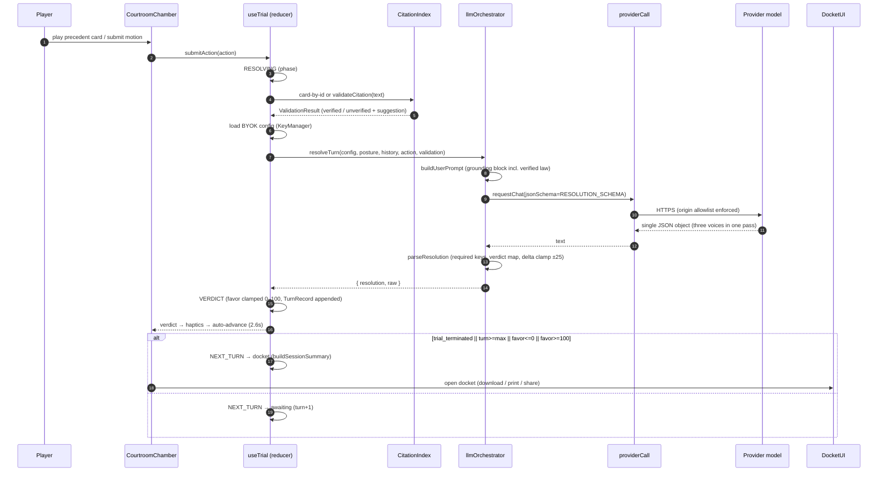

# Overrool

> Roll for precedent. Object to hearsay. Win with the law.

Overrool is an adversarial legal strategy courtroom card game built with React 19, TypeScript, Tailwind CSS v4, and a zero-cost BYOK (bring-your-own-key) LLM orchestrator. Players pick a side, spend strategy tokens, deploy precedent cards, cite statutes, and push the Judge's Favor Meter to 0 (dismissal) or 100 (victory). It ships an embedded global corpus of real, published landmark judgments from seven legal systems (United States, United Kingdom, European Union, Canada, Australia, South Africa, India), client-side factual citation verification, a single-pass **multi-role** LLM resolution loop (Presiding Judge, Opposing Senior Advocate, and Co-Counsel voices resolved in one structured JSON turn), and an in-app Advocate Consultation Docket export (markdown / print / share).

---

## Problem statement

Practising courtroom strategy — framing motions, anticipating a bench's reasoning, distinguishing hostile precedent, and knowing when a citation is real — is a high-cost, high-stakes skill with no safe, free way to train alone. Legal AI assistants are either expensive subscriptions, opaque black-boxes that fabricate authority, or both.

Overrool addresses four concrete gaps:

1. **Open by default — unlimited accounts.** No per-seat cost. The platform runs on Cloudflare's free tiers (Pages, D1, Workers AI); signups are unlimited and the only server-side AI path (Workers AI) is reserved for the single administrator's own trials. Everyone else plays on BYOK, which for most players means Google's free Gemini tier at zero cost forever.
2. **Zero-cost practice.** No ecosystem token budget, no server-side API keys, no third-party proxy (Google Fonts are likewise self-hosted). Every LLM call runs directly from the player's browser to the player's own provider account using the key they supply under their own quota (Gemini, OpenAI, Anthropic, or Groq). Google's **Gemini API free tier** (key from Google AI Studio) is a natural no-card starting point, and the account administrator can host serverside inference on Cloudflare's free Workers AI tier for their own trials.
3. **Factual grounding.** The engine refuses to reward fabricated law. Writer-side citations are checked against an embedded 43-case / 10-statute global corpus; unverifiable authority is flagged as exposure in the docket and the bench responds accordingly.
4. **Accountable, exportable outcomes.** Each turn is resolved in a single structured LLM pass and captured as a typed `TurnRecord`, and the session is rendered into an Advocate Consultation Docket — admitted precedents, identified exposure points, and actionable consultation questions — that is downloadable, printable, and shareable.

**Constraint.** Overrool is an educational legal-literacy and strategic-simulation tool under the Information Technology Act, 2000. It does not provide legal advice and cannot replace a certified advocate registered under the Advocates Act, 1961. Users must verify all citations against certified law reports.

---

## Architecture

```
overrool/
├── public/
│   ├── data/
│   │   ├── global_cases.json             ← embedded corpus: 43 landmark cases (US/UK/EU/CA/AU/ZA/IN) + 10 statutes
│   │   └── scenarios.json             ← 4 hand-crafted procedural fact patterns
│   ├── manifest.webmanifest           ← PWA manifest (Legal Noir palette)
│   └── sw.js                          ← cache-first service worker (hashed /assets/ + /data/)
├── src/
│   ├── components/                    ← React UI
│   │   ├── CaseSelect.tsx             ← scenario gallery grid
│   │   ├── CourtroomChamber.tsx       ← main battle screen (deck, motions, log, verdict flash)
│   │   ├── DocketExportModal.tsx      ← docket modal: download/print/share (exports buildPrintHtml, escapeHtml)
│   │   ├── FavorMeter.tsx             ← horizontal Judicial Favor bar (exports lerpColor, favorColor)
│   │   ├── KeySettings.tsx            ← BYOK key modal (provider, model, persist, live test)
│   │   ├── PrecedentCard.tsx          ← citation card (domain emoji, ratio, statutory chips, exhaustion)
│   │   └── StatutoryNotice.tsx        ← mandatory statutory rider
│   ├── core/                          ← shared logic (no UI)
│   │   ├── dataLoader.ts              ← /data/ fetch + scenario hydration (dedup, cache)
│   │   ├── docket.ts                  ← session summary builder + consultation questions + markdown/sharing
│   │   ├── haptics.ts                 ← Capacitor Haptics thin wrapper (no-op on web)
│   │   ├── llmOrchestrator.ts         ← resolveTurn: prompt build → JSON-resolution parse + verdict mapping
│   │   ├── providerCall.ts            ← BYOK network layer: origin allowlist, 90s timeout, per-provider shapes, Gemini key header
│   │   ├── searchIndex.ts             ← MiniSearch citation index + validateCitation (precedent/statute)
│   │   ├── storage.ts                 ← KeyManager (BYOK): Capacitor SecureStorage (native) or localStorage/sessionStorage (web)
│   │   └── useTrial.ts                ← reducer-based trial state machine (favor, phase, turn, log)
│   │   └── *.test.ts                  ← Vitest suites adjacent to their module (21 files, 194 tests)
│   ├── types/
│   │   └── legal.ts                   ← all shared TS interfaces + constants (STATUTORY_NOTICE, VERDICT_TAGS, MODEL_DEFAULTS usage)
│   ├── App.tsx                        ← screen shell (loading / home / trial) + key-vault modal + error fallbacks
│   ├── index.css                      ← Tailwind Legal Noir theme tokens
│   └── main.tsx                       ← React root
├── src-tauri/                         ← Tauri v2 desktop shell (Rust) — identifier com.overrool.courts
│   ├── Cargo.toml
│   ├── tauri.conf.json                ← authoritative Tauri config (CSP locked to the 4 provider origins)
│   ├── capabilities/default.json
│   └── src/                           ← main.rs, lib.rs, build.rs
├── capacitor.config.ts                ← Capacitor 8 mobile shell (com.overrool.courts, androidScheme https)
├── vitest.config.ts                   ← jsdom + v8 coverage thresholds
├── vite.config.ts                     ← React + Tailwind plugins
└── tsconfig.json                      ← strict, bundler, ES2022
```

> The authoritative Tauri configuration lives in `src-tauri/tauri.conf.json`. There is intentionally no root-level `tauri.conf.json`.

### Architecture diagram


### Turn-resolution sequence



---

## Quick start

```bash
git clone https://github.com/z99wE/overruled.git overrool && cd overrool

# ensure PATH includes local node/npm (adjust as needed):
export PATH="$HOME/.local/bin:$PATH"

npm install
npm install-scripts approve esbuild fsevents   # npm 12 blocks install scripts

npm run dev        # http://localhost:5173
```

Open the app, arm the Key Vault with a provider key, pick a matter, and play. All inference runs from your browser against your own provider account.

---

## Available scripts

| Script | What it does |
|--------|-------------|
| `npm run dev` | Vite dev server with HMR |
| `npm run build` | `tsc --noEmit` + Vite production build → `dist/` |
| `npm run preview` | Serve production build locally |
| `npm run typecheck` | `tsc --noEmit` (app) + `tsc -p tsconfig.workers.json` (Pages Functions) |
| `npm run lint` | ESLint over `src`, `functions`, `scripts` |
| `npm run test` | Vitest run (all `src/**` + `functions/**` suites, 194 tests) |
| `npm run test:coverage` | Vitest with v8 coverage report + thresholds |
| `npm run icons` | Regenerate `public/icons/*.png` from `public/icon.svg` (needs `sharp`) |
| `npm run cf:dev` | `wrangler pages dev` — static shell + Functions + local D1 |
| `npm run cf:deploy` | Build + `wrangler pages deploy` to Cloudflare Pages |
| `npm run d1:create` | Create the D1 database (once, then paste its id into `wrangler.toml`) |
| `npm run d1:migrate` | Apply `d1/schema.sql` to remote D1 |
| `npm run cap:sync` | Sync web assets to iOS/Android (requires Capacitor CLI + Xcode/Android Studio) |
| `npm run tauri` | Tauri desktop dev/build (requires Rust toolchain + Tauri CLI) |

---

## BYOK storage security

- **LLM keys never leave the device.** All LLM calls are made client-side by `providerCall.ts` directly to the four allowlisted provider origins. There is no LLM proxy. Error reporting is opt-in: `@sentry/react` is wired but stays dormant unless `VITE_SENTRY_DSN` is set (see `src/core/telemetry.ts`).
- **Origin allowlist.** `providerCall.ts` enforces a `PROVIDER_ORIGINS` allowlist (Gemini, OpenAI, Anthropic, Groq) before any network call — an SSRF-style guard against malformed or hostile URLs. A 90-second `AbortSignal` timeout applies to every request.
- **Gemini keys** are transmitted in the `x-goog-api-key` header, never in the URL query string.
- **Storage.** On Capacitor (iOS/Android) keys live in the native Keychain via `@aparajita/capacitor-secure-storage`. On web they are kept under the `overrool.byok.*` namespace in `localStorage` when persistence is on, otherwise `sessionStorage` (single copy, alternate store is cleaned). **Keys are never sent to Overrool's servers.** The only things that may be hosted server-side are *optional* account credentials and game-progress saves when the player signs in (see [Deployment → Cloudflare Pages](#deployment)); that traffic never includes API keys. BYOK configs are **identity-scoped** (`storage.ts`): a key armed under account A can never be read or billed by account B on the same device.
- **Hosted inference exception (admin only).** The workspace administrator (single `role='admin'` account) can enable **Hosted (Cloudflare)** in the Key Vault — the only server-side LLM path. It calls the same-origin `POST /api/llm` function, which requires a session **and** the admin role and proxy the admin's turn to the `AI` binding (Workers AI). No Workers AI credential ever appears in the UI, the admin email is never exposed — only the `role` flag — and everyone else stays on BYOK. See [`AUTH.md`](AUTH.md) for the role-grant runbook and quota handling.
- Default provider models are listed in `storage.ts` (`MODEL_DEFAULTS`) and are model-overridable per provider. Providers: `gemini`, `openai`, `anthropic`, `groq` (plus `hosted` for the admin).
- For production hardening on Tauri desktop, wire `tauri-plugin-store` or Tauri's `safeStorage` in place of the in-memory fallback.

---

## The trial loop (how resolution works)

1. **Player action.** Each turn the player either *plays a precedent card* from their deck (verified by id) or issues a *freeform motion* (verified against the corpus via `searchIndex.validateCitation`).
2. **Local verification.** `validateCitation` resolves SCC citations, aliases, statute sections (including decimal subsections such as MV Aggregator Guidelines `1.1`), and informal statute-name references, returning a `ValidationResult` with the specific precedent/statute or a suggestion.
3. **One LLM pass.** `resolveTurn` sends the case posture, turn history, current action, and the verification result to the configured provider in a single structured call (`jsonSchema` / `response_format: json_object` / JSON directive), and maps the reply into a typed `TurnResolution`.
4. **Verdict + state.** `useTrial`'s reducer clamps judicial favor to `[0, 100]`, appends the `TurnRecord`, and terminates the trial on `trial_terminated`, max turns, or favor hitting an extreme.
5. **Docket.** `buildSessionSummary` separates admitted precedents from exposure points (including *unverified / fabricated authority* flags and bench warnings) and feeds the export modal's markdown / print / share.

---

## Embedded corpus

`public/data/global_cases.json` ships **43 case entries** spanning the Supreme Court of the United States, the UK House of Lords and Court of Appeal, the Court of Justice of the European Union, the Supreme Court of Canada, the High Court of Australia, the Constitutional Court of South Africa, and the Supreme Court of India — plus **10 statutory references** (GDPR, the U.S. First and Fourth Amendments, the Canadian Charter, the Human Rights Act 1998, the Native Title Act 1993, the South African Constitution, the Constitution of India, FRA 2006, UCC Article 2). Every entry uses its real case name, citation, court, and ratio decidendi, with aliases, key tags, and jurisdiction tags. This is a fixed snapshot; modify the JSON to update the corpus. The corpus is served as a static asset, so subsequent loads are cache-first via `sw.js`.

### Adding a new case

Append an entry to the `cases` array in `global_cases.json` (keep the real case name and citation — no invented parties):

```jsonc
{
  "id": "your-case-id",          // unique slug
  "caseName": "Appellant v. Respondent",
  "citation": "(2025) 1 SCC 123",
  "year": 2025,
  "court": "Supreme Court of India",   // or "High Court" / "National Green Tribunal"
  "ratioDecidendi": "Held: ...",
  "statutoryProvisions": ["IT Act 2000 §43A"],
  "keyTags": ["digital privacy", "data breach"],
  "aliases": ["privacy case", "data breach ruling"],
  "domain": "constitutional"            // one of the Domain union values
}
```

Then rebuild: `npm run build`.

---

## Adding a new case file / statute / scenario

### Statutes

Append an entry to the `statutes` array in `global_cases.json`:

```jsonc
{
  "id": "act-2025",                    // unique slug
  "citation": "Some Act, 2025",
  "name": "Some Act 2025",
  "year": 2025,
  "keyTags": ["privacy", "consent"],
  "domain": "digital_rights",
  "sections": [
    { "section": "§4(1)", "title": "Consent", "principle": "Written consent of the data principal is required." }
  ]
}
```

The section matcher supports integer sections (`§4`, `R.2(4)`) and decimal subsections (`1.1`, `5.1`).

### Scenarios

`public/data/scenarios.json` holds the scenario catalogue. Each entry uses the following schema (this is the exact shape consumed by `dataLoader.ts` and the component tree):

| Field | Type | Purpose |
|-------|------|---------|
| `id` | string | Unique slug (game route / lookup key) |
| `title` | string | Courtroom banner title |
| `clientName` | string | Client identifier for the docket header |
| `bench` | string | Court / tribunal name shown in the chamber header |
| `factualBackground` | string | Judicial-style statement of operative facts |
| `coreDispute` | string | The single legal question in contention |
| `initialJudicialFavor` | number | Opening favor between `0` and `100` |
| `maxTurns` | number | Turn budget before cases is decided |
| `precedentIds` | `string[]` | Corpus case ids resolved into the player's starting deck |
| `statuteIds` | `string[]` | Corpus statute ids offered as statutory anchors |
| `opposingCounselPersona` | `{ name, style, initialOpeningStatement, interlocutoryAttackTheme }` | Opposing counsel identity (name, `Aggressive` / `Technical_Procedural` / `Constitutional_Statist`, opening, attack theme) |
| `closingPrompt` | string | Prompt snippet injected on the final turn |

Duplicate an existing entry, change the id/facts/persona, add any new precedents or statutes to `global_cases.json` if needed, and the game picks it up automatically.

---

## Coding conventions

- **TypeScript** — strict, no `any`, no unused locals/parameters, no barrel re-exports.
- **Functional components only** — React 19, hooks preferred. No class components.
- **No default exports** — named exports only throughout `src/`.
- **No inline comments** unless strictly necessary for correctness.
- **State management** — `useReducer` (see `useTrial.ts`) + local component state. No Redux.
- **Styling** — Tailwind v4 utility classes only; no CSS-in-JS; theme tokens live in `index.css`.
- **Imports** — relative paths in source files. (No Vite path aliases are configured; do not introduce them.)
- **Tests** — Vitest + jsdom; business logic in `src/core/` via `.test.ts` files adjacent to source; pure helpers (e.g. `escapeHtml`, `favorColor`) tested directly; no snapshot tests. Coverage thresholds are enforced in `vitest.config.ts`.
- **Commit messages** — imperative mood, lowercase, ≤ 72 chars, no trailing periods, scoped prefix when relevant: `fix(searchIndex):`, `feat(corpus):`, `chore(deps):`.

---

## Test coverage & known gaps

What is automated today (`npm run test`, v8 coverage thresholds in `vitest.config.ts`):

- **Core engine**: `dataLoader`, `searchIndex` (citation/statute verification incl. fabricated-authority rejection), `llmOrchestrator` (prompt, malformed-JSON handling, delta clamp), `providerCall` (origin allowlist / SSRF guard, HTTP-error handling, all four provider request shapes), `docket` (summary, exposure flags, consultation questions), `storage` (persist/session split, contamination regression), `useTrial` (full reducer state machine), `haptics` (web + native).
- **Pure UI helpers**: `escapeHtml`/`buildPrintHtml` (XSS neutralisation in exports), `favorColor`/`lerpColor`.

Known gaps — declared honestly:

- **No UI component tests.** `App`, `CourtroomChamber`, `KeySettings`, `CaseSelect`, `PrecedentCard` are covered only indirectly; interactions are not automated.
- **No live-provider E2E test.** The network layer is mock-tested; a real key is required to exercise a genuine Gemini/OpenAI/Anthropic/Groq round-trip, so that path is not in CI.
- **Mobile/desktop shells are unbuilt scaffolds.** Capacitor `ios/`/`android/` and Tauri icons are not generated (icons: `npx tauri icon <png>`); Rust toolchain needed for Tauri.
- The PWA service worker caches only `/assets/` and `/data/`; offline behaviour for first-time navigations is not verified automatically.

## Deployment

### Cloudflare Pages (recommended — includes accounts)

The app ships as a static PWA **plus** an accounts API. Accounts and game-progress sync live entirely on Cloudflare: **Pages Functions** (the `/api/auth/*` and `/api/run` endpoints) backed by **D1** (SQLite). LLM keys never touch this stack — they stay in the player's browser and talk to the provider directly.

Provision once (see [`AUTH.md`](AUTH.md) for the full runbook):

```bash
npm run d1:create                          # creates the D1 database, prints its id
# paste the printed database_id into wrangler.toml
npm run d1:migrate                         # apply d1/schema.sql (users, sessions, runs, login_attempts, recovery_codes, password_resets)
npm run cf:deploy                          # build + wrangler pages deploy dist
```

Local, full-stack dev is `npm run cf:dev` (serves `dist/` with Functions against your D1 binding).

What the API does (`functions/api/`):

- `POST /api/auth/signup` · `POST /api/auth/login` · `POST /api/auth/logout` · `GET /api/auth/me` — email + password accounts. Passwords are stored as **salted PBKDF2-SHA256** hashes (100k iterations (Workers crypto cap)); sessions are opaque 32-byte tokens whose SHA-256 digest is stored, delivered as `HttpOnly; Secure; SameSite=Strict` cookies (`__Host-overrool_session`). One active session per account (login rotates).
- `POST /api/auth/forgot` · `POST /api/auth/reset` — **password recovery**: single-use 30-minute reset tokens (SHA-256 digest stored) delivered by email when a Resend sender is configured, with recovery codes (`/api/auth/recovery/*`) as the always-on Cloudflare-native fallback (8 codes per account, only hashes stored, each redeemable once to set a new password). See `AUTH.md` §6.
- `GET/PUT /api/run` — account-scoped game-progress save (chips, XP, jokers, bosses). Signed-in players sync automatically; signed-out play is 100% device-local.
- `POST /api/llm` — admin-only hosted inference proxy to the Workers AI `AI` binding (free tier). See `AUTH.md` §7.

Declared account gaps (see `AUTH.md`): no email verification (there is no transactional email on Pages beyond the optional Resend reset link), and sessions are single-bearer-token (no refresh rotation beyond login). Failed logins are rate-limited per email in-app (`429 login_locked` after 10 fails / 15 min) and password recovery is fully self-contained (reset tokens + recovery codes); a Cloudflare WAF rate rule can still be layered onto `/api/auth/*` for IP-level aggregation.

Known static-host notes:

- `public/_redirects` re-serves the SPA shell (`/* → /index.html 200`) so refresh/direct links work; `/api/*` is handled by Functions first.
- `public/_headers` ships security headers incl. a CSP whose `connect-src` allowlists the four LLM providers.
- Assets are hashed and cached immutable for 1 year; icons are real 192/512 PNG + maskable (regenerate with `npm run icons`).
- Deploy at a domain root (Vite uses absolute base paths).

### Any static host (no accounts)

If you don't want the Cloudflare Functions layer, deploy `dist/` anywhere; the auth UI degrades to a friendly "account API not reachable" error and the game remains fully playable keyless or BYOK. `public/sw.js` (`overrool-v10`) is a cache-first service worker that caches `/assets/` + `/data/` and never intercepts BYOK traffic.

### iOS / Android (Capacitor)

```bash
npm run build
npx cap sync ios      # or cap sync android
open ios/App.xcworkspace
```

See: https://capacitorjs.com/docs/getting-started/environment-setup

### macOS / Windows / Linux (Tauri)

Requires Rust + system libraries:

```bash
xcode-select --install
curl --proto '=https' --tlsv1.2 -sSf https://sh.rustup.rs | sh

npm run tauri dev    # local dev with hot-reload
npm run tauri build  # produces bundles in src-tauri/target/
```

Before the first Tauri build you must generate the app icons referenced by `src-tauri/tauri.conf.json` (the `icons/*` set is not committed):

```bash
npx tauri icon path/to/512x512.png
```

The Tauri window CSP is locked to the four BYOK provider origins (`generativelanguage.googleapis.com`, `api.openai.com`, `api.anthropic.com`, `api.groq.com`) so keys cannot be exfiltrated to other endpoints from the desktop shell.

---

## Repository hygiene

- `.gitignore` excludes `node_modules/`, `dist/`, native build outputs (`ios/`, `android/`, `src-tauri/target/`, `src-tauri/gen/`), env files, and tooling state (`.freebuff/`).
- No API keys, tokens, or secrets are checked in — KEYS ARE ALWAYS PLAYER-SUPPLIED AT RUNTIME. Scan before any push: `rg -i "sk-[A-Za-z0-9]{20}|AIza[0-9A-Za-z_-]{20}" .`

---

## See also

- [**PRIVACY.md**](PRIVACY.md) — what the app stores and never stores (keys, cookies, hosted-inference path).
- [**DISCLAIMER.md**](DISCLAIMER.md) — educational simulation; not legal advice.
- [**SECURITY.md**](SECURITY.md) — security model and vulnerability reporting.
- [**AUTH.md**](AUTH.md) — Cloudflare deployment runbook incl. the hosted-inference role grant.
- [**CONTRIBUTING.md**](CONTRIBUTING.md) — how to build, test, and contribute.

---

## License

MIT — see `LICENSE`.